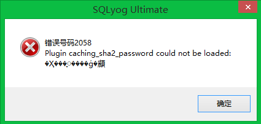
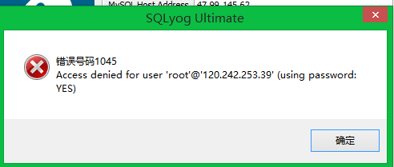

## 问题1：密码加密问题



1.1 具体原因

> 新的MySQL 8.0安装，在初始化数据目录时，将 ‘root’@'localhost’创建帐户，并且该帐户caching_sha2_password默认使用，密码的加密方法发生了改变，因此SQLyog不能正常解析，才报出如上错误。

1.2 解决办法

> 登陆本地客户端

```mysql
ALTER USER 'root'@'localhost' IDENTIFIED WITH mysql_native_password BY 'xxxx';
ALTER USER 'wangchao'@'%' IDENTIFIED WITH mysql_native_password BY 'xxxxx';
```

## 问题2：权限问题



> 解决办法：密码中不要有特殊字符