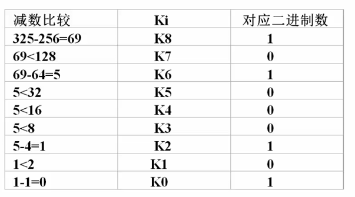
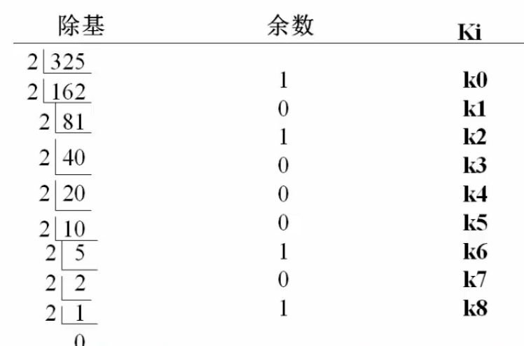
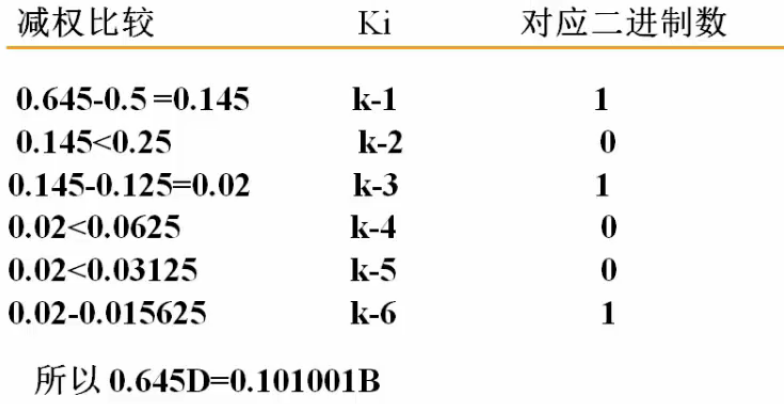
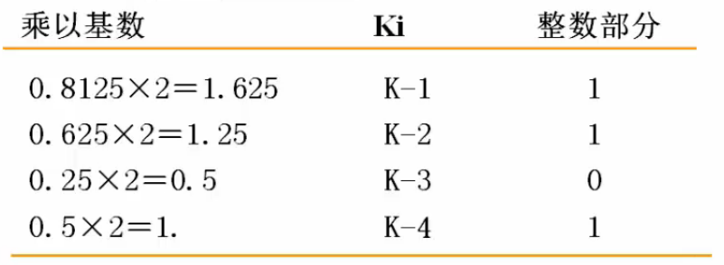
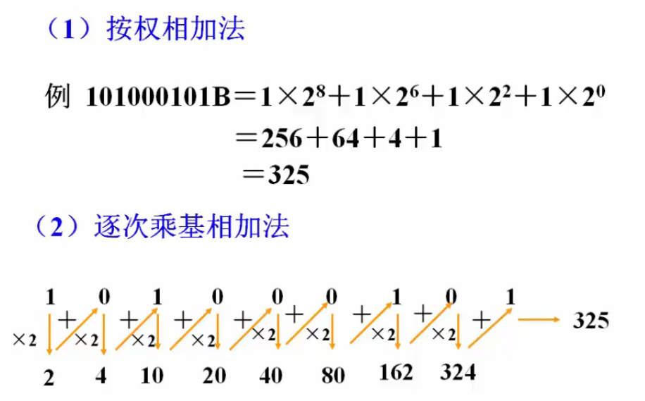
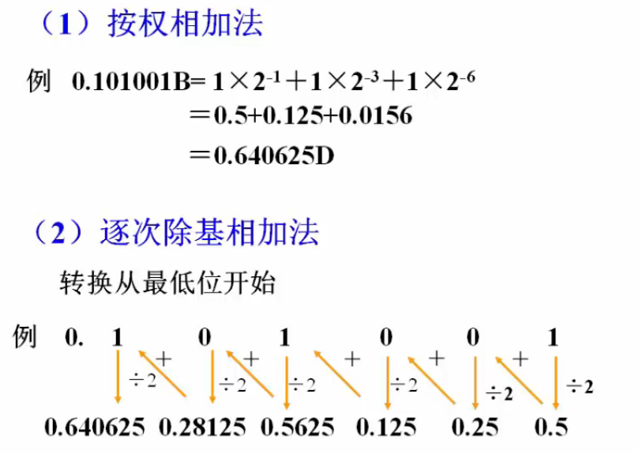

## 一、汇编语言的一般概念

### 1. 计算机程序设计语言

> 计算机程序设计语言可分为
>
> - 机器语言
> - 高级语言
> - 汇编语言

#### 1.1 机器语言

> 机器语言就是把控制计算机的命令和各种数据直接用二进制数码表示的一种程序设计语言。

例如：

```C
// (AH)=(AH)+10
1011 0100 0000 1010
// 4*6+40
//(AL)=(AL)*(BL)+(CL)
1111 0110 1110 0011 // F6E3 乘法
0000 0000 1100 1000 // 00C8 加法
```

> 特点：
>
> - 机器指令中既包含指示运算功能的代码，又给出了参加运算的操作数据，代码非常详细
> - 不好阅读，不好记忆
> - 运行效率最高，程序长度最短

#### 1.2 高级语言

> 高级语言将计算机内部的操作细节屏蔽起来，用户不需要知道计算机内部的数据的传送和处理的细节。使用类似于自然语言的一些语句来编制程序，完成指定的任务。

```c
a=a+10;
a=a*b+c;
```

> 特点
>
> - 程序设计简单，但是程序效率较机器语言低
> - 开发周期要比汇编短

#### 1.3 汇编语言

> 用处：
>
> - 追求高效率，例如实时系统
> - 方便记忆，理解，阅读
>
> 描述性定义：
>
> 为了方便阅读和记忆，使用字符和符号来表示机器语言的命令，用十进制或者十六进制来表述数据

##### 1. 汇编语言程序与机器语言程序的关系

> 一条汇编语言的语句和一条机器语言指令对，汇编语言程序与机器语言程序效率相同

##### 2. 不同类型计算机有不同的机器指令系统和汇编语言描述

> 为了学习和使用某种计算机的汇编语言，必须熟悉计算机的内部组成结构。但并非要掌握计算机系统的全部硬件组成，只需掌握用汇编语言编制程序时所涉及到的那些硬件的结构和功能

### 2. 学习和使用汇编语言的目的

> - 学习和使用汇编语言可以从根本上认识、理解计算机的工作过程
> - 在计算机系统中，某些功能必须要用汇编语言程序来实现
>   - 机器自检
>   - 系统初始化
>   - 实际的输入输出设备的操作等
> - 汇编语言程序的效率要高于高级语言程序
>   - 程序的目标代码长度和运行速度

## 二、进位计数制及其相互转化

### 1. 进位计数制

> 使用一定个数数码的组合来表示数字，这种表示的方法称为进位计数制。根据所使用的数码的个数，就产生了不同的进位计数制。

#### 1.1 基本概念

> - 权（位权）：各个位置上所表示的基本数值大小
>   - 不同的进位制和不同的位置其位权是不同的。位权乘以对应位置上的数码就等于该数位上数值的大小。
> - 基数：每个数位上能使用不同数码的个数
>   - 十进制的基数为10

> 注：计算机内部的数用二进制表示

#### 1.2 常用的进制

> - 二进制：B（Binary）
> - 八进制: O(Octal)
> - 十进制: D(Decimal)
> - 十六进制: H(Hexadecimal)

### 2. 相互转化

#### 2.1  二进制、八进制和十六进制相互转化

> 添0即可

#### 2.2 十进制转化成二进制

##### 2.2.1 整数

> - 减权定位法



> - 除2取余法



##### 2.2.2 小数

> - 减权定位法



> - 乘基取整法



#### 2.3 二进制转化为十进制





## 三、带符号数的表示（此处略吧）

> 真值： 用“+”或者“-”表示正负的数
>
> 机器数：用“0”或“1”表示正负的数，原码，反码，补码

### 1. 原码

> - 8位原码整数
>   - 范围：-127~127
>   - 0：1000 0000 或者 0000 0000
> - 8位原码小数

### 2. 反码

### 3. 补码

## 四、 字符表示

> ASCII
>
> - 一共128（33+95）个
> - 最高位奇偶校验 
>
> UNICODE等

## 五、基本的逻辑运算

> 与运算
>
> 或运算
>
> 非运算
>
> 异或运算