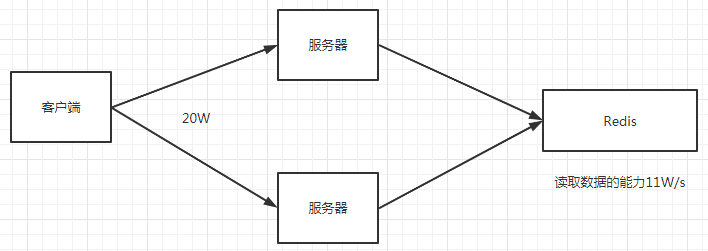
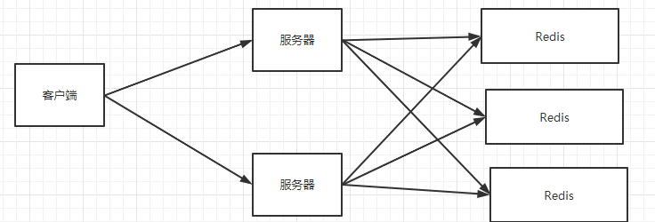
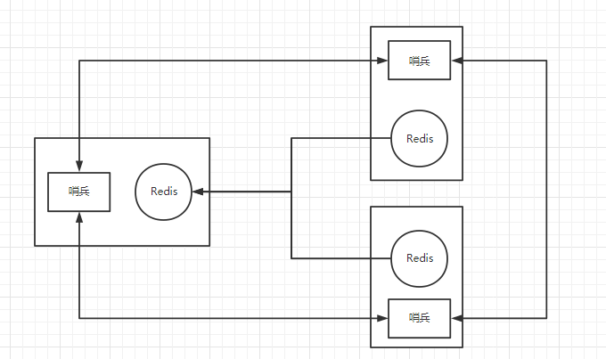
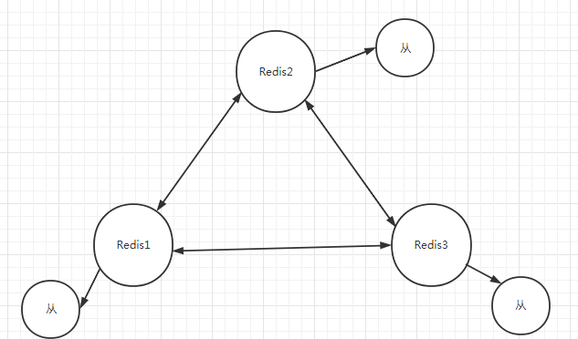

# 搭建集群

```yml
version: "3.1"
services:
  redis1:
    image: daocloud.io/library/redis:5.0.7
    restart: always
    container_name: redis1
    environment:
      - TZ=Asia/shanghai
    ports:
      - 6379:6379
    volumes:
      - ./conf/redis.conf:/data/redis.conf
    command: ["redis-server","/data/redis.conf"]
    
```

## 一、单机版Redis存在的问题



> 1. 扛不住大量并发，存在读写瓶颈的问题
> 2. 单点故障

## 二、 主从架构






> 1.  单点故障 哨兵模式解决
> 2. 读写分离，

### 2.1 搭建

```yml
version: "3.1"
services:
  redis1:
    image: daocloud.io/library/redis:5.0.7
    restart: always
    container_name: redis1
    environment:
      - TZ=Asia/shanghai
    ports:
      - 6384:6379
    volumes:
      - ./redis-1/conf:/usr/local/etc/redis
      - ./redis-1/data:/data
      - ./redis-1/logs:/logs
    command: ["redis-server","/usr/local/etc/redis/redis1.conf"]
  redis2:
    image: daocloud.io/library/redis:5.0.7
    restart: always
    container_name: redis2
    environment:
      - TZ=Asia/shanghai
    ports:
      - 6385:6379
    volumes:
      - ./redis-2/conf:/usr/local/etc/redis
      - ./redis-2/data:/data
      - ./redis-2/logs:/logs
    links:
      - redis1:master
    command: ["redis-server","/usr/local/etc/redis/redis2.conf"]
  redis3:
    image: daocloud.io/library/redis:5.0.7
    restart: always
    container_name: redis3
    environment:
      - TZ=Asia/shanghai
    ports:
      - 6386:6379
    volumes:
      - ./redis-3/conf:/usr/local/etc/redis
      - ./redis-3/data:/data
      - ./redis-3/logs:/logs
    links:
      - redis1:master
    command: ["redis-server","/usr/local/etc/redis/redis3.conf"]
```

## 三、 Redis 集群

> 1.  Redis集群是无中心的
> 2.  Redis集群有一个Ping—Pong机制
> 3.  Redis集群有投票机制，节点数必须是2n+1
> 4.  Redis集群默认分配了16384个hash槽，在存储数据时，会将key进行crc16的算法，并且对16384取余，  并且根据最终的结果，将key-value存放到执行Redis节点中，而且每一个Redis集群都在维护着对应的hash槽
> 5.  为了保证数据的安全性，每一个集群的节点，至少要跟着一个从节点
> 6.  单独的对Redis集群中的节点搭建主从
> 7.  当Redis集群中，超过半数的节点宕机之后，Redis集群就瘫痪了



### 3.1 搭建

1. docker-compose.yml

```yml
# docker-compose.yml
version: "3.1"
services:
  redis1:
    image: daocloud.io/library/redis:5.0.7
    restart: always
    container_name: redis-cluster-1
    environment:
      - TZ=Asia/shanghai
    ports:
      - 46301:46301
      - 56301:56301
    volumes:
      - ./redis-1/conf:/usr/local/etc/redis
      - ./redis-1/data:/data
      - ./redis-1/logs:/logs
    command: ["redis-server","/usr/local/etc/redis/redis.conf"]
  redis2:
    image: daocloud.io/library/redis:5.0.7
    restart: always
    container_name: redis-cluster-2
    environment:
      - TZ=Asia/shanghai
    ports:
      - 46302:46302
      - 56302:56302
    volumes:
      - ./redis-2/conf:/usr/local/etc/redis
      - ./redis-2/data:/data
      - ./redis-2/logs:/logs
    command: ["redis-server","/usr/local/etc/redis/redis.conf"]
  redis3:
    image: daocloud.io/library/redis:5.0.7
    restart: always
    container_name: redis-cluster-3
    environment:
      - TZ=Asia/shanghai
    ports:
      - 46303:46303
      - 56303:56303
    volumes:
      - ./redis-3/conf:/usr/local/etc/redis
      - ./redis-3/data:/data
      - ./redis-3/logs:/logs
    command: ["redis-server","/usr/local/etc/redis/redis.conf"]
  redis4:
    image: daocloud.io/library/redis:5.0.7
    restart: always
    container_name: redis-cluster-4
    environment:
      - TZ=Asia/shanghai
    ports:
      - 46304:46304
      - 56304:56304
    volumes:
      - ./redis-4/conf:/usr/local/etc/redis
      - ./redis-4/data:/data
      - ./redis-4/logs:/logs
    command: ["redis-server","/usr/local/etc/redis/redis.conf"]
  redis5:
    image: daocloud.io/library/redis:5.0.7
    restart: always
    container_name: redis-cluster-5
    environment:
      - TZ=Asia/shanghai
    ports:
      - 46305:46305
      - 56305:56305
    volumes:
      - ./redis-5/conf:/usr/local/etc/redis
      - ./redis-5/data:/data
      - ./redis-5/logs:/logs
    command: ["redis-server","/usr/local/etc/redis/redis.conf"]
  redis6:
    image: daocloud.io/library/redis:5.0.7
    restart: always
    container_name: redis-cluster-6
    environment:
      - TZ=Asia/shanghai
    ports:
      - 46306:46306
      - 56306:56306
    volumes:
      - ./redis-6/conf:/usr/local/etc/redis
      - ./redis-6/data:/data
      - ./redis-6/logs:/logs
    command: ["redis-server","/usr/local/etc/redis/redis.conf"]
```

---

2. 配置文件

```yml
# redis.conf
# 指定redis的端口号
port 46301
# 开启Redis集群
cluster-enabled yes
# 集群的配置信息文件
cluster-config-file nodes-46301.conf
# 集群对外的ip地址
cluster-announce-ip 192.168.1.60
# 集群对外的端口号
cluster-announce-port 46301
# 集群的总线端口
cluster-announce-bus-port 56301
```

3. 集群构建

```bash
redis-cli --cluster create  192.168.1.60:46301 192.168.1.60:46302 192.168.1.60:46303 192.168.1.60:46304 192.168.1.60:46305 192.168.1.60:46306 --cluster-replicas 1
```

