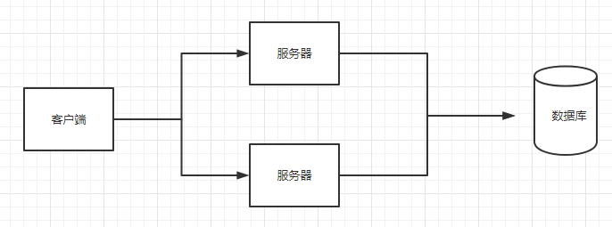
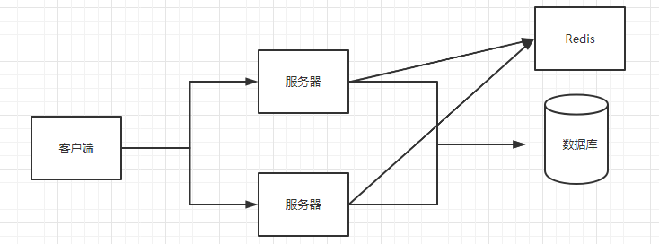

> Author: wangchao
>
> create_date: 2020-12-25
>
> modify_date: 2020-12-25
>
> version: 1.0

## 一、 存在的问题

> 1. 由于用户量增大，请求数量也随之增大，导致数据库压力过大
> 2. 多台服务器之间数据不同步
> 3. 实现分布式锁，传统锁失效

> 1. Redis是基于内存存储数据和读取数据的
> 2. 可以将之前存储在Session中的共享数据统一地存放在Redis中
> 3. Redis接收用户的请求是单线程的

## 二、Redis介绍

> 有一位意大利人，在开发一款LLOOGG的统计页面时，因为MySQL的性能不好，自己研发了一款非关系型数据库，并命名为Redis.
>
> Redis的作者，叫Salvatore Sanfilippo，来自意大利的西西里岛，居住在卡塔尼亚。目前供职于Pivotal公司。他使用的网名是antirez。
>
> Redis(Remote Dictionary Server)是由C语言去编写的，Redis是一款基于Key-Value的非关系数据库，Redis 是基于内存存储数据的，Redis还提供了多种持久化机制，性能可以达到110000/s读取数据以及81000/s写入数据。

## 三、安装与配置

### 1. 安装

### 2. 配置文件

