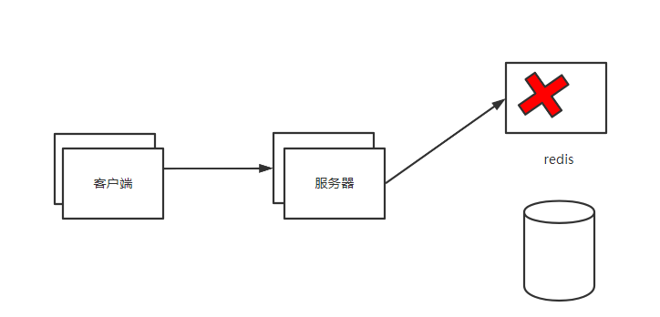

# 1. 缓存穿透

> 问题出现的原因： 查询的数据在缓存中也没有，在数据库中也没有

> 解决办法：
>
> 1. 根据id查询，将id最大值或者最小值放到Redis中，在查询之前检查
> 2. 如果id不是整型。可以将id放在set中，查询之前可以先检查
> 3. 获取客户端的ip地址，做访问次数限制

# 2. 缓存击穿

> 问题出现的原因：缓存中的热点数据，突然到期了，造成大量的请求都去访问数据库，造成数据库宕机

> 解决办法：
>
> 1.  在访问缓存中没有的时候，直接添加锁，让几个请求去访问数据库，避免数据库宕机
> 2.  热点数据的生存时间去掉（不建议）

# 3. 缓存雪崩

> 问题：Redis大量缓存集中到期，大量请求同时访问数据库

> 解决办法：将缓存中的数据的生存时间设置为随机时间

# 4. 缓存倾斜

> 问题：热点数据放在了一个Redis节点上，导致Redis节点无法承受大量的请求，最终Redis宕机

> 解决办法：
>
> 1.  扩展主从架构，搭建大量的从节点，缓解Redis的压力
> 2.  可以在服务器中做JVM缓存，在查询Redis之前，先去查询Tomcat中的缓存

